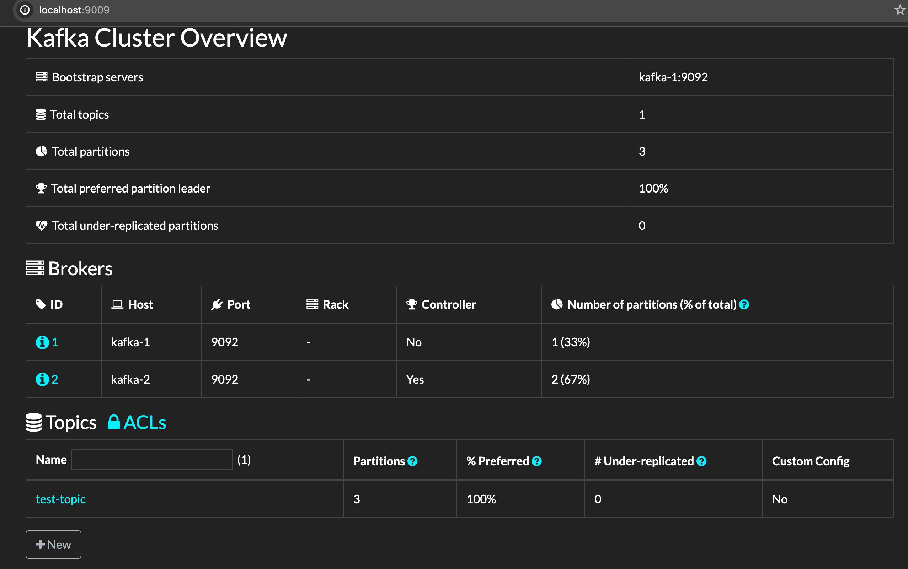

Docker is one of the most popular container engines used in the software industry to create, package and deploy applications.

To start an Apache Kafka server, we’d first need to start a Zookeeper server.
We can configure this dependency in a docker-compose.yml file, which will ensure that the Zookeeper server always starts before the Kafka server and stops after it.

Let’s start the Kafka server by spinning up the containers using the docker-compose command:
```bash
$ docker-compose up -d
Creating network "kafka_default" with the default driver
Creating kafka_zookeeper_1 ... done
Creating kafka_kafka_1     ... done
```

- Guide : <i>https://velog.io/@jskim/Muti-Broker-Kafka-Cluster%EC%99%80-%ED%86%B5%EC%8B%A0%ED%95%98%EB%8A%94-%EA%B0%84%EB%8B%A8%ED%95%9C-Producer-Consumer-%EB%A7%8C%EB%93%A4%EA%B8%B0, 
https://www.baeldung.com/ops/kafka-docker-setup</i>


For more stable environments, we’ll need a resilient setup. Let’s extend our docker-compose.yml file to create a multi-node Kafka cluster setup.
A cluster setup for Apache Kafka needs to have redundancy for both Zookeeper servers and the Kafka servers.

So, let’s add configuration for one more node each for Zookeeper and Kafka services into docker-compose.yml

#### Kafka Install
```bash
# Monitoring
kafka-monitoring:
    image: obsidiandynamics/kafdrop
    restart: "no"
    ports:
      - "9009:9000"
    environment:
      KAFKA_BROKER_CONNECT: "kafka-1:9092"
    depends_on:
      - kafka-1
      - kafka-2
```

#### Create Topic
```bash
docker exec -it kafka-cluster-kafka-1-1 kafka-topics --bootstrap-server=localhost:9092 --create --topic test-topic --partitions 3 --replication-factor 1
```

#### Kafka Monitoring
